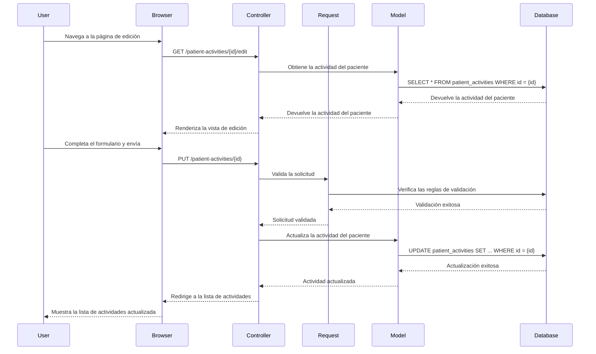

### Explicación de los Cambios Realizados en los Documentos Adjuntos

#### 1. **UpdatePatientActivityRequest.php**
Este archivo es una clase de solicitud personalizada que se utiliza para validar y autorizar las solicitudes de actualización de actividades de pacientes.

- **Método [`authorize`](command:_github.copilot.openSymbolFromReferences?%5B%22%22%2C%5B%7B%22uri%22%3A%7B%22scheme%22%3A%22file%22%2C%22authority%22%3A%22%22%2C%22path%22%3A%22%2FC%3A%2FUsers%2FEmilio%2FDesktop%2Fdemos%2Fteapp%2Fsrc%2Fapp%2FHttp%2FRequests%2FStorePatientActivityRequest.php%22%2C%22query%22%3A%22%22%2C%22fragment%22%3A%22%22%7D%2C%22pos%22%3A%7B%22line%22%3A14%2C%22character%22%3A20%7D%7D%2C%7B%22uri%22%3A%7B%22scheme%22%3A%22file%22%2C%22authority%22%3A%22%22%2C%22path%22%3A%22%2Fc%3A%2FUsers%2FEmilio%2FDesktop%2Fdemos%2Fteapp%2Fsrc%2Fapp%2FHttp%2FRequests%2FUpdatePatientActivityRequest.php%22%2C%22query%22%3A%22%22%2C%22fragment%22%3A%22%22%7D%2C%22pos%22%3A%7B%22line%22%3A13%2C%22character%22%3A20%7D%7D%5D%2C%22e63f4d6e-0ffe-401c-8e0a-f26faeafd1dd%22%5D "Go to definition")**: Siempre devuelve [`true`](command:_github.copilot.openSymbolFromReferences?%5B%22%22%2C%5B%7B%22uri%22%3A%7B%22scheme%22%3A%22file%22%2C%22authority%22%3A%22%22%2C%22path%22%3A%22%2FC%3A%2FUsers%2FEmilio%2FDesktop%2Fdemos%2Fteapp%2Fsrc%2Fapp%2FHttp%2FRequests%2FStorePatientActivityRequest.php%22%2C%22query%22%3A%22%22%2C%22fragment%22%3A%22%22%7D%2C%22pos%22%3A%7B%22line%22%3A16%2C%22character%22%3A15%7D%7D%2C%7B%22uri%22%3A%7B%22scheme%22%3A%22file%22%2C%22authority%22%3A%22%22%2C%22path%22%3A%22%2Fc%3A%2FUsers%2FEmilio%2FDesktop%2Fdemos%2Fteapp%2Fsrc%2Fapp%2FHttp%2FRequests%2FUpdatePatientActivityRequest.php%22%2C%22query%22%3A%22%22%2C%22fragment%22%3A%22%22%7D%2C%22pos%22%3A%7B%22line%22%3A15%2C%22character%22%3A15%7D%7D%5D%2C%22e63f4d6e-0ffe-401c-8e0a-f26faeafd1dd%22%5D "Go to definition"), lo que significa que cualquier usuario está autorizado para hacer esta solicitud.
- **Método [`rules`](command:_github.copilot.openSymbolFromReferences?%5B%22%22%2C%5B%7B%22uri%22%3A%7B%22scheme%22%3A%22file%22%2C%22authority%22%3A%22%22%2C%22path%22%3A%22%2FC%3A%2FUsers%2FEmilio%2FDesktop%2Fdemos%2Fteapp%2Fsrc%2Fapp%2FHttp%2FRequests%2FStorePatientActivityRequest.php%22%2C%22query%22%3A%22%22%2C%22fragment%22%3A%22%22%7D%2C%22pos%22%3A%7B%22line%22%3A20%2C%22character%22%3A26%7D%7D%2C%7B%22uri%22%3A%7B%22scheme%22%3A%22file%22%2C%22authority%22%3A%22%22%2C%22path%22%3A%22%2Fc%3A%2FUsers%2FEmilio%2FDesktop%2Fdemos%2Fteapp%2Fsrc%2Fapp%2FHttp%2FRequests%2FUpdatePatientActivityRequest.php%22%2C%22query%22%3A%22%22%2C%22fragment%22%3A%22%22%7D%2C%22pos%22%3A%7B%22line%22%3A19%2C%22character%22%3A26%7D%7D%5D%2C%22e63f4d6e-0ffe-401c-8e0a-f26faeafd1dd%22%5D "Go to definition")**: Define las reglas de validación para los campos [`description`](command:_github.copilot.openSymbolFromReferences?%5B%22%22%2C%5B%7B%22uri%22%3A%7B%22scheme%22%3A%22file%22%2C%22authority%22%3A%22%22%2C%22path%22%3A%22%2FC%3A%2FUsers%2FEmilio%2FDesktop%2Fdemos%2Fteapp%2Fsrc%2Fapp%2FHttp%2FRequests%2FStorePatientActivityRequest.php%22%2C%22query%22%3A%22%22%2C%22fragment%22%3A%22%22%7D%2C%22pos%22%3A%7B%22line%22%3A28%2C%22character%22%3A13%7D%7D%2C%7B%22uri%22%3A%7B%22scheme%22%3A%22file%22%2C%22authority%22%3A%22%22%2C%22path%22%3A%22%2Fc%3A%2FUsers%2FEmilio%2FDesktop%2Fdemos%2Fteapp%2Fsrc%2Fapp%2FHttp%2FRequests%2FUpdatePatientActivityRequest.php%22%2C%22query%22%3A%22%22%2C%22fragment%22%3A%22%22%7D%2C%22pos%22%3A%7B%22line%22%3A26%2C%22character%22%3A13%7D%7D%2C%7B%22uri%22%3A%7B%22scheme%22%3A%22file%22%2C%22authority%22%3A%22%22%2C%22path%22%3A%22%2FC%3A%2FUsers%2FEmilio%2FDesktop%2Fdemos%2Fteapp%2Fsrc%2Fapp%2FModels%2FPatientActivity.php%22%2C%22query%22%3A%22%22%2C%22fragment%22%3A%22%22%7D%2C%22pos%22%3A%7B%22line%22%3A16%2C%22character%22%3A9%7D%7D%2C%7B%22uri%22%3A%7B%22scheme%22%3A%22file%22%2C%22authority%22%3A%22%22%2C%22path%22%3A%22%2FC%3A%2FUsers%2FEmilio%2FDesktop%2Fdemos%2Fteapp%2Fsrc%2Fdatabase%2Fmigrations%2F2024_10_22_005058_create_patient_activities_table.php%22%2C%22query%22%3A%22%22%2C%22fragment%22%3A%22%22%7D%2C%22pos%22%3A%7B%22line%22%3A19%2C%22character%22%3A26%7D%7D%2C%7B%22uri%22%3A%7B%22scheme%22%3A%22file%22%2C%22authority%22%3A%22%22%2C%22path%22%3A%22%2FC%3A%2FUsers%2FEmilio%2FDesktop%2Fdemos%2Fteapp%2Fsrc%2Fresources%2Fviews%2Fpatient-activities%2Fcreate.blade.php%22%2C%22query%22%3A%22%22%2C%22fragment%22%3A%22%22%7D%2C%22pos%22%3A%7B%22line%22%3A28%2C%22character%22%3A26%7D%7D%2C%7B%22uri%22%3A%7B%22scheme%22%3A%22file%22%2C%22authority%22%3A%22%22%2C%22path%22%3A%22%2FC%3A%2FUsers%2FEmilio%2FDesktop%2Fdemos%2Fteapp%2Fsrc%2Fresources%2Fviews%2Fpatient-activities%2Fedit.blade.php%22%2C%22query%22%3A%22%22%2C%22fragment%22%3A%22%22%7D%2C%22pos%22%3A%7B%22line%22%3A18%2C%22character%22%3A24%7D%7D%2C%7B%22uri%22%3A%7B%22scheme%22%3A%22file%22%2C%22authority%22%3A%22%22%2C%22path%22%3A%22%2FC%3A%2FUsers%2FEmilio%2FDesktop%2Fdemos%2Fteapp%2Fsrc%2Fresources%2Fviews%2Fpatient-activities%2Findex.blade.php%22%2C%22query%22%3A%22%22%2C%22fragment%22%3A%22%22%7D%2C%22pos%22%3A%7B%22line%22%3A57%2C%22character%22%3A79%7D%7D%2C%7B%22uri%22%3A%7B%22scheme%22%3A%22file%22%2C%22authority%22%3A%22%22%2C%22path%22%3A%22%2FC%3A%2FUsers%2FEmilio%2FDesktop%2Fdemos%2Fteapp%2Fsrc%2Fresources%2Fviews%2Fpatient-activities%2Fshow.blade.php%22%2C%22query%22%3A%22%22%2C%22fragment%22%3A%22%22%7D%2C%22pos%22%3A%7B%22line%22%3A33%2C%22character%22%3A53%7D%7D%5D%2C%22e63f4d6e-0ffe-401c-8e0a-f26faeafd1dd%22%5D "Go to definition"), [`reasons`](command:_github.copilot.openSymbolFromReferences?%5B%22%22%2C%5B%7B%22uri%22%3A%7B%22scheme%22%3A%22file%22%2C%22authority%22%3A%22%22%2C%22path%22%3A%22%2FC%3A%2FUsers%2FEmilio%2FDesktop%2Fdemos%2Fteapp%2Fsrc%2Fapp%2FHttp%2FRequests%2FStorePatientActivityRequest.php%22%2C%22query%22%3A%22%22%2C%22fragment%22%3A%22%22%7D%2C%22pos%22%3A%7B%22line%22%3A29%2C%22character%22%3A13%7D%7D%2C%7B%22uri%22%3A%7B%22scheme%22%3A%22file%22%2C%22authority%22%3A%22%22%2C%22path%22%3A%22%2Fc%3A%2FUsers%2FEmilio%2FDesktop%2Fdemos%2Fteapp%2Fsrc%2Fapp%2FHttp%2FRequests%2FUpdatePatientActivityRequest.php%22%2C%22query%22%3A%22%22%2C%22fragment%22%3A%22%22%7D%2C%22pos%22%3A%7B%22line%22%3A27%2C%22character%22%3A13%7D%7D%2C%7B%22uri%22%3A%7B%22scheme%22%3A%22file%22%2C%22authority%22%3A%22%22%2C%22path%22%3A%22%2FC%3A%2FUsers%2FEmilio%2FDesktop%2Fdemos%2Fteapp%2Fsrc%2Fapp%2FModels%2FPatientActivity.php%22%2C%22query%22%3A%22%22%2C%22fragment%22%3A%22%22%7D%2C%22pos%22%3A%7B%22line%22%3A17%2C%22character%22%3A9%7D%7D%2C%7B%22uri%22%3A%7B%22scheme%22%3A%22file%22%2C%22authority%22%3A%22%22%2C%22path%22%3A%22%2FC%3A%2FUsers%2FEmilio%2FDesktop%2Fdemos%2Fteapp%2Fsrc%2Fdatabase%2Fmigrations%2F2024_10_22_005058_create_patient_activities_table.php%22%2C%22query%22%3A%22%22%2C%22fragment%22%3A%22%22%7D%2C%22pos%22%3A%7B%22line%22%3A20%2C%22character%22%3A26%7D%7D%2C%7B%22uri%22%3A%7B%22scheme%22%3A%22file%22%2C%22authority%22%3A%22%22%2C%22path%22%3A%22%2FC%3A%2FUsers%2FEmilio%2FDesktop%2Fdemos%2Fteapp%2Fsrc%2Fresources%2Fviews%2Fpatient-activities%2Fcreate.blade.php%22%2C%22query%22%3A%22%22%2C%22fragment%22%3A%22%22%7D%2C%22pos%22%3A%7B%22line%22%3A34%2C%22character%22%3A26%7D%7D%2C%7B%22uri%22%3A%7B%22scheme%22%3A%22file%22%2C%22authority%22%3A%22%22%2C%22path%22%3A%22%2FC%3A%2FUsers%2FEmilio%2FDesktop%2Fdemos%2Fteapp%2Fsrc%2Fresources%2Fviews%2Fpatient-activities%2Fedit.blade.php%22%2C%22query%22%3A%22%22%2C%22fragment%22%3A%22%22%7D%2C%22pos%22%3A%7B%22line%22%3A34%2C%22character%22%3A26%7D%7D%2C%7B%22uri%22%3A%7B%22scheme%22%3A%22file%22%2C%22authority%22%3A%22%22%2C%22path%22%3A%22%2FC%3A%2FUsers%2FEmilio%2FDesktop%2Fdemos%2Fteapp%2Fsrc%2Fresources%2Fviews%2Fpatient-activities%2Fshow.blade.php%22%2C%22query%22%3A%22%22%2C%22fragment%22%3A%22%22%7D%2C%22pos%22%3A%7B%22line%22%3A39%2C%22character%22%3A53%7D%7D%5D%2C%22e63f4d6e-0ffe-401c-8e0a-f26faeafd1dd%22%5D "Go to definition"), [`goals`](command:_github.copilot.openSymbolFromReferences?%5B%22%22%2C%5B%7B%22uri%22%3A%7B%22scheme%22%3A%22file%22%2C%22authority%22%3A%22%22%2C%22path%22%3A%22%2FC%3A%2FUsers%2FEmilio%2FDesktop%2Fdemos%2Fteapp%2Fsrc%2Fapp%2FHttp%2FRequests%2FStorePatientActivityRequest.php%22%2C%22query%22%3A%22%22%2C%22fragment%22%3A%22%22%7D%2C%22pos%22%3A%7B%22line%22%3A30%2C%22character%22%3A13%7D%7D%2C%7B%22uri%22%3A%7B%22scheme%22%3A%22file%22%2C%22authority%22%3A%22%22%2C%22path%22%3A%22%2Fc%3A%2FUsers%2FEmilio%2FDesktop%2Fdemos%2Fteapp%2Fsrc%2Fapp%2FHttp%2FRequests%2FUpdatePatientActivityRequest.php%22%2C%22query%22%3A%22%22%2C%22fragment%22%3A%22%22%7D%2C%22pos%22%3A%7B%22line%22%3A28%2C%22character%22%3A13%7D%7D%2C%7B%22uri%22%3A%7B%22scheme%22%3A%22file%22%2C%22authority%22%3A%22%22%2C%22path%22%3A%22%2FC%3A%2FUsers%2FEmilio%2FDesktop%2Fdemos%2Fteapp%2Fsrc%2Fapp%2FModels%2FPatientActivity.php%22%2C%22query%22%3A%22%22%2C%22fragment%22%3A%22%22%7D%2C%22pos%22%3A%7B%22line%22%3A18%2C%22character%22%3A9%7D%7D%2C%7B%22uri%22%3A%7B%22scheme%22%3A%22file%22%2C%22authority%22%3A%22%22%2C%22path%22%3A%22%2FC%3A%2FUsers%2FEmilio%2FDesktop%2Fdemos%2Fteapp%2Fsrc%2Fdatabase%2Fmigrations%2F2024_10_22_005058_create_patient_activities_table.php%22%2C%22query%22%3A%22%22%2C%22fragment%22%3A%22%22%7D%2C%22pos%22%3A%7B%22line%22%3A21%2C%22character%22%3A26%7D%7D%2C%7B%22uri%22%3A%7B%22scheme%22%3A%22file%22%2C%22authority%22%3A%22%22%2C%22path%22%3A%22%2FC%3A%2FUsers%2FEmilio%2FDesktop%2Fdemos%2Fteapp%2Fsrc%2Fresources%2Fviews%2Fpatient-activities%2Fcreate.blade.php%22%2C%22query%22%3A%22%22%2C%22fragment%22%3A%22%22%7D%2C%22pos%22%3A%7B%22line%22%3A40%2C%22character%22%3A26%7D%7D%2C%7B%22uri%22%3A%7B%22scheme%22%3A%22file%22%2C%22authority%22%3A%22%22%2C%22path%22%3A%22%2FC%3A%2FUsers%2FEmilio%2FDesktop%2Fdemos%2Fteapp%2Fsrc%2Fresources%2Fviews%2Fpatient-activities%2Fedit.blade.php%22%2C%22query%22%3A%22%22%2C%22fragment%22%3A%22%22%7D%2C%22pos%22%3A%7B%22line%22%3A40%2C%22character%22%3A26%7D%7D%2C%7B%22uri%22%3A%7B%22scheme%22%3A%22file%22%2C%22authority%22%3A%22%22%2C%22path%22%3A%22%2FC%3A%2FUsers%2FEmilio%2FDesktop%2Fdemos%2Fteapp%2Fsrc%2Fresources%2Fviews%2Fpatient-activities%2Fshow.blade.php%22%2C%22query%22%3A%22%22%2C%22fragment%22%3A%22%22%7D%2C%22pos%22%3A%7B%22line%22%3A45%2C%22character%22%3A53%7D%7D%5D%2C%22e63f4d6e-0ffe-401c-8e0a-f26faeafd1dd%22%5D "Go to definition") e [`indicators`](command:_github.copilot.openSymbolFromReferences?%5B%22%22%2C%5B%7B%22uri%22%3A%7B%22scheme%22%3A%22file%22%2C%22authority%22%3A%22%22%2C%22path%22%3A%22%2FC%3A%2FUsers%2FEmilio%2FDesktop%2Fdemos%2Fteapp%2Fsrc%2Fapp%2FHttp%2FRequests%2FStorePatientActivityRequest.php%22%2C%22query%22%3A%22%22%2C%22fragment%22%3A%22%22%7D%2C%22pos%22%3A%7B%22line%22%3A31%2C%22character%22%3A13%7D%7D%2C%7B%22uri%22%3A%7B%22scheme%22%3A%22file%22%2C%22authority%22%3A%22%22%2C%22path%22%3A%22%2Fc%3A%2FUsers%2FEmilio%2FDesktop%2Fdemos%2Fteapp%2Fsrc%2Fapp%2FHttp%2FRequests%2FUpdatePatientActivityRequest.php%22%2C%22query%22%3A%22%22%2C%22fragment%22%3A%22%22%7D%2C%22pos%22%3A%7B%22line%22%3A29%2C%22character%22%3A13%7D%7D%2C%7B%22uri%22%3A%7B%22scheme%22%3A%22file%22%2C%22authority%22%3A%22%22%2C%22path%22%3A%22%2FC%3A%2FUsers%2FEmilio%2FDesktop%2Fdemos%2Fteapp%2Fsrc%2Fapp%2FModels%2FPatientActivity.php%22%2C%22query%22%3A%22%22%2C%22fragment%22%3A%22%22%7D%2C%22pos%22%3A%7B%22line%22%3A19%2C%22character%22%3A9%7D%7D%2C%7B%22uri%22%3A%7B%22scheme%22%3A%22file%22%2C%22authority%22%3A%22%22%2C%22path%22%3A%22%2FC%3A%2FUsers%2FEmilio%2FDesktop%2Fdemos%2Fteapp%2Fsrc%2Fdatabase%2Fmigrations%2F2024_10_22_005058_create_patient_activities_table.php%22%2C%22query%22%3A%22%22%2C%22fragment%22%3A%22%22%7D%2C%22pos%22%3A%7B%22line%22%3A22%2C%22character%22%3A26%7D%7D%2C%7B%22uri%22%3A%7B%22scheme%22%3A%22file%22%2C%22authority%22%3A%22%22%2C%22path%22%3A%22%2FC%3A%2FUsers%2FEmilio%2FDesktop%2Fdemos%2Fteapp%2Fsrc%2Fresources%2Fviews%2Fpatient-activities%2Fcreate.blade.php%22%2C%22query%22%3A%22%22%2C%22fragment%22%3A%22%22%7D%2C%22pos%22%3A%7B%22line%22%3A46%2C%22character%22%3A26%7D%7D%2C%7B%22uri%22%3A%7B%22scheme%22%3A%22file%22%2C%22authority%22%3A%22%22%2C%22path%22%3A%22%2FC%3A%2FUsers%2FEmilio%2FDesktop%2Fdemos%2Fteapp%2Fsrc%2Fresources%2Fviews%2Fpatient-activities%2Fedit.blade.php%22%2C%22query%22%3A%22%22%2C%22fragment%22%3A%22%22%7D%2C%22pos%22%3A%7B%22line%22%3A46%2C%22character%22%3A26%7D%7D%2C%7B%22uri%22%3A%7B%22scheme%22%3A%22file%22%2C%22authority%22%3A%22%22%2C%22path%22%3A%22%2FC%3A%2FUsers%2FEmilio%2FDesktop%2Fdemos%2Fteapp%2Fsrc%2Fresources%2Fviews%2Fpatient-activities%2Fshow.blade.php%22%2C%22query%22%3A%22%22%2C%22fragment%22%3A%22%22%7D%2C%22pos%22%3A%7B%22line%22%3A51%2C%22character%22%3A53%7D%7D%5D%2C%22e63f4d6e-0ffe-401c-8e0a-f26faeafd1dd%22%5D "Go to definition"), todos los cuales son obligatorios y deben ser cadenas de texto.
- **Método [`messages`](command:_github.copilot.openSymbolFromReferences?%5B%22%22%2C%5B%7B%22uri%22%3A%7B%22scheme%22%3A%22file%22%2C%22authority%22%3A%22%22%2C%22path%22%3A%22%2FC%3A%2FUsers%2FEmilio%2FDesktop%2Fdemos%2Fteapp%2Fsrc%2Fapp%2FHttp%2FRequests%2FStorePatientActivityRequest.php%22%2C%22query%22%3A%22%22%2C%22fragment%22%3A%22%22%7D%2C%22pos%22%3A%7B%22line%22%3A36%2C%22character%22%3A21%7D%7D%2C%7B%22uri%22%3A%7B%22scheme%22%3A%22file%22%2C%22authority%22%3A%22%22%2C%22path%22%3A%22%2Fc%3A%2FUsers%2FEmilio%2FDesktop%2Fdemos%2Fteapp%2Fsrc%2Fapp%2FHttp%2FRequests%2FUpdatePatientActivityRequest.php%22%2C%22query%22%3A%22%22%2C%22fragment%22%3A%22%22%7D%2C%22pos%22%3A%7B%22line%22%3A34%2C%22character%22%3A21%7D%7D%5D%2C%22e63f4d6e-0ffe-401c-8e0a-f26faeafd1dd%22%5D "Go to definition")**: Proporciona mensajes de error personalizados en español para cada regla de validación.
- **Método [`failedValidation`](command:_github.copilot.openSymbolFromReferences?%5B%22%22%2C%5B%7B%22uri%22%3A%7B%22scheme%22%3A%22file%22%2C%22authority%22%3A%22%22%2C%22path%22%3A%22%2FC%3A%2FUsers%2FEmilio%2FDesktop%2Fdemos%2Fteapp%2Fsrc%2Fapp%2FHttp%2FRequests%2FStorePatientActivityRequest.php%22%2C%22query%22%3A%22%22%2C%22fragment%22%3A%22%22%7D%2C%22pos%22%3A%7B%22line%22%3A57%2C%22character%22%3A23%7D%7D%2C%7B%22uri%22%3A%7B%22scheme%22%3A%22file%22%2C%22authority%22%3A%22%22%2C%22path%22%3A%22%2Fc%3A%2FUsers%2FEmilio%2FDesktop%2Fdemos%2Fteapp%2Fsrc%2Fapp%2FHttp%2FRequests%2FUpdatePatientActivityRequest.php%22%2C%22query%22%3A%22%22%2C%22fragment%22%3A%22%22%7D%2C%22pos%22%3A%7B%22line%22%3A54%2C%22character%22%3A23%7D%7D%5D%2C%22e63f4d6e-0ffe-401c-8e0a-f26faeafd1dd%22%5D "Go to definition")**: Personaliza el manejo de errores de validación para lanzar un toast de error.

#### 2. **2024_10_22_005058_create_patient_activities_table.php**
Este archivo es una migración que crea la tabla [`patient_activities`](command:_github.copilot.openSymbolFromReferences?%5B%22%22%2C%5B%7B%22uri%22%3A%7B%22scheme%22%3A%22file%22%2C%22authority%22%3A%22%22%2C%22path%22%3A%22%2FC%3A%2FUsers%2FEmilio%2FDesktop%2Fdemos%2Fteapp%2Fsrc%2Fdatabase%2Fmigrations%2F2024_10_22_005058_create_patient_activities_table.php%22%2C%22query%22%3A%22%22%2C%22fragment%22%3A%22%22%7D%2C%22pos%22%3A%7B%22line%22%3A13%2C%22character%22%3A24%7D%7D%5D%2C%22e63f4d6e-0ffe-401c-8e0a-f26faeafd1dd%22%5D "Go to definition") en la base de datos.

- **Método [`up`](command:_github.copilot.openSymbolFromReferences?%5B%22%22%2C%5B%7B%22uri%22%3A%7B%22scheme%22%3A%22file%22%2C%22authority%22%3A%22%22%2C%22path%22%3A%22%2FC%3A%2FUsers%2FEmilio%2FDesktop%2Fdemos%2Fteapp%2Fsrc%2Fdatabase%2Fmigrations%2F2024_10_22_005058_create_patient_activities_table.php%22%2C%22query%22%3A%22%22%2C%22fragment%22%3A%22%22%7D%2C%22pos%22%3A%7B%22line%22%3A11%2C%22character%22%3A20%7D%7D%5D%2C%22e63f4d6e-0ffe-401c-8e0a-f26faeafd1dd%22%5D "Go to definition")**: Define la estructura de la tabla [`patient_activities`](command:_github.copilot.openSymbolFromReferences?%5B%22%22%2C%5B%7B%22uri%22%3A%7B%22scheme%22%3A%22file%22%2C%22authority%22%3A%22%22%2C%22path%22%3A%22%2FC%3A%2FUsers%2FEmilio%2FDesktop%2Fdemos%2Fteapp%2Fsrc%2Fdatabase%2Fmigrations%2F2024_10_22_005058_create_patient_activities_table.php%22%2C%22query%22%3A%22%22%2C%22fragment%22%3A%22%22%7D%2C%22pos%22%3A%7B%22line%22%3A13%2C%22character%22%3A24%7D%7D%5D%2C%22e63f4d6e-0ffe-401c-8e0a-f26faeafd1dd%22%5D "Go to definition") con campos como [`user_id`](command:_github.copilot.openSymbolFromReferences?%5B%22%22%2C%5B%7B%22uri%22%3A%7B%22scheme%22%3A%22file%22%2C%22authority%22%3A%22%22%2C%22path%22%3A%22%2FC%3A%2FUsers%2FEmilio%2FDesktop%2Fdemos%2Fteapp%2Fsrc%2Fapp%2FHttp%2FControllers%2FPatientActivityController.php%22%2C%22query%22%3A%22%22%2C%22fragment%22%3A%22%22%7D%2C%22pos%22%3A%7B%22line%22%3A39%2C%22character%22%3A20%7D%7D%2C%7B%22uri%22%3A%7B%22scheme%22%3A%22file%22%2C%22authority%22%3A%22%22%2C%22path%22%3A%22%2FC%3A%2FUsers%2FEmilio%2FDesktop%2Fdemos%2Fteapp%2Fsrc%2Fapp%2FModels%2FPatientActivity.php%22%2C%22query%22%3A%22%22%2C%22fragment%22%3A%22%22%7D%2C%22pos%22%3A%7B%22line%22%3A13%2C%22character%22%3A9%7D%7D%2C%7B%22uri%22%3A%7B%22scheme%22%3A%22file%22%2C%22authority%22%3A%22%22%2C%22path%22%3A%22%2FC%3A%2FUsers%2FEmilio%2FDesktop%2Fdemos%2Fteapp%2Fsrc%2Fdatabase%2Fmigrations%2F2024_10_22_005058_create_patient_activities_table.php%22%2C%22query%22%3A%22%22%2C%22fragment%22%3A%22%22%7D%2C%22pos%22%3A%7B%22line%22%3A15%2C%22character%22%3A31%7D%7D%5D%2C%22e63f4d6e-0ffe-401c-8e0a-f26faeafd1dd%22%5D "Go to definition"), [`patient_id`](command:_github.copilot.openSymbolFromReferences?%5B%22%22%2C%5B%7B%22uri%22%3A%7B%22scheme%22%3A%22file%22%2C%22authority%22%3A%22%22%2C%22path%22%3A%22%2FC%3A%2FUsers%2FEmilio%2FDesktop%2Fdemos%2Fteapp%2Fsrc%2Fapp%2FHttp%2FControllers%2FPatientActivityController.php%22%2C%22query%22%3A%22%22%2C%22fragment%22%3A%22%22%7D%2C%22pos%22%3A%7B%22line%22%3A13%2C%22character%22%3A38%7D%7D%2C%7B%22uri%22%3A%7B%22scheme%22%3A%22file%22%2C%22authority%22%3A%22%22%2C%22path%22%3A%22%2FC%3A%2FUsers%2FEmilio%2FDesktop%2Fdemos%2Fteapp%2Fsrc%2Fapp%2FModels%2FPatientActivity.php%22%2C%22query%22%3A%22%22%2C%22fragment%22%3A%22%22%7D%2C%22pos%22%3A%7B%22line%22%3A14%2C%22character%22%3A9%7D%7D%2C%7B%22uri%22%3A%7B%22scheme%22%3A%22file%22%2C%22authority%22%3A%22%22%2C%22path%22%3A%22%2FC%3A%2FUsers%2FEmilio%2FDesktop%2Fdemos%2Fteapp%2Fsrc%2Fdatabase%2Fmigrations%2F2024_10_22_005058_create_patient_activities_table.php%22%2C%22query%22%3A%22%22%2C%22fragment%22%3A%22%22%7D%2C%22pos%22%3A%7B%22line%22%3A16%2C%22character%22%3A31%7D%7D%2C%7B%22uri%22%3A%7B%22scheme%22%3A%22file%22%2C%22authority%22%3A%22%22%2C%22path%22%3A%22%2FC%3A%2FUsers%2FEmilio%2FDesktop%2Fdemos%2Fteapp%2Fsrc%2Fresources%2Fviews%2Fpatient-activities%2Fcreate.blade.php%22%2C%22query%22%3A%22%22%2C%22fragment%22%3A%22%22%7D%2C%22pos%22%3A%7B%22line%22%3A3%2C%22character%22%3A52%7D%7D%2C%7B%22uri%22%3A%7B%22scheme%22%3A%22file%22%2C%22authority%22%3A%22%22%2C%22path%22%3A%22%2FC%3A%2FUsers%2FEmilio%2FDesktop%2Fdemos%2Fteapp%2Fsrc%2Fresources%2Fviews%2Fpatient-activities%2Fedit.blade.php%22%2C%22query%22%3A%22%22%2C%22fragment%22%3A%22%22%7D%2C%22pos%22%3A%7B%22line%22%3A3%2C%22character%22%3A52%7D%7D%2C%7B%22uri%22%3A%7B%22scheme%22%3A%22file%22%2C%22authority%22%3A%22%22%2C%22path%22%3A%22%2FC%3A%2FUsers%2FEmilio%2FDesktop%2Fdemos%2Fteapp%2Fsrc%2Fresources%2Fviews%2Fpatient-activities%2Findex.blade.php%22%2C%22query%22%3A%22%22%2C%22fragment%22%3A%22%22%7D%2C%22pos%22%3A%7B%22line%22%3A5%2C%22character%22%3A20%7D%7D%2C%7B%22uri%22%3A%7B%22scheme%22%3A%22file%22%2C%22authority%22%3A%22%22%2C%22path%22%3A%22%2FC%3A%2FUsers%2FEmilio%2FDesktop%2Fdemos%2Fteapp%2Fsrc%2Fresources%2Fviews%2Fpatient-activities%2Fshow.blade.php%22%2C%22query%22%3A%22%22%2C%22fragment%22%3A%22%22%7D%2C%22pos%22%3A%7B%22line%22%3A3%2C%22character%22%3A52%7D%7D%5D%2C%22e63f4d6e-0ffe-401c-8e0a-f26faeafd1dd%22%5D "Go to definition"), [`activity_id`](command:_github.copilot.openSymbolFromReferences?%5B%22%22%2C%5B%7B%22uri%22%3A%7B%22scheme%22%3A%22file%22%2C%22authority%22%3A%22%22%2C%22path%22%3A%22%2FC%3A%2FUsers%2FEmilio%2FDesktop%2Fdemos%2Fteapp%2Fsrc%2Fapp%2FHttp%2FRequests%2FStorePatientActivityRequest.php%22%2C%22query%22%3A%22%22%2C%22fragment%22%3A%22%22%7D%2C%22pos%22%3A%7B%22line%22%3A27%2C%22character%22%3A13%7D%7D%2C%7B%22uri%22%3A%7B%22scheme%22%3A%22file%22%2C%22authority%22%3A%22%22%2C%22path%22%3A%22%2FC%3A%2FUsers%2FEmilio%2FDesktop%2Fdemos%2Fteapp%2Fsrc%2Fapp%2FModels%2FPatientActivity.php%22%2C%22query%22%3A%22%22%2C%22fragment%22%3A%22%22%7D%2C%22pos%22%3A%7B%22line%22%3A15%2C%22character%22%3A9%7D%7D%2C%7B%22uri%22%3A%7B%22scheme%22%3A%22file%22%2C%22authority%22%3A%22%22%2C%22path%22%3A%22%2FC%3A%2FUsers%2FEmilio%2FDesktop%2Fdemos%2Fteapp%2Fsrc%2Fdatabase%2Fmigrations%2F2024_10_22_005058_create_patient_activities_table.php%22%2C%22query%22%3A%22%22%2C%22fragment%22%3A%22%22%7D%2C%22pos%22%3A%7B%22line%22%3A17%2C%22character%22%3A31%7D%7D%2C%7B%22uri%22%3A%7B%22scheme%22%3A%22file%22%2C%22authority%22%3A%22%22%2C%22path%22%3A%22%2FC%3A%2FUsers%2FEmilio%2FDesktop%2Fdemos%2Fteapp%2Fsrc%2Fresources%2Fviews%2Fpatient-activities%2Fcreate.blade.php%22%2C%22query%22%3A%22%22%2C%22fragment%22%3A%22%22%7D%2C%22pos%22%3A%7B%22line%22%3A17%2C%22character%22%3A24%7D%7D%2C%7B%22uri%22%3A%7B%22scheme%22%3A%22file%22%2C%22authority%22%3A%22%22%2C%22path%22%3A%22%2FC%3A%2FUsers%2FEmilio%2FDesktop%2Fdemos%2Fteapp%2Fsrc%2Fresources%2Fviews%2Fpatient-activities%2Fedit.blade.php%22%2C%22query%22%3A%22%22%2C%22fragment%22%3A%22%22%7D%2C%22pos%22%3A%7B%22line%22%3A14%2C%22character%22%3A22%7D%7D%5D%2C%22e63f4d6e-0ffe-401c-8e0a-f26faeafd1dd%22%5D "Go to definition"), [`description`](command:_github.copilot.openSymbolFromReferences?%5B%22%22%2C%5B%7B%22uri%22%3A%7B%22scheme%22%3A%22file%22%2C%22authority%22%3A%22%22%2C%22path%22%3A%22%2FC%3A%2FUsers%2FEmilio%2FDesktop%2Fdemos%2Fteapp%2Fsrc%2Fapp%2FHttp%2FRequests%2FStorePatientActivityRequest.php%22%2C%22query%22%3A%22%22%2C%22fragment%22%3A%22%22%7D%2C%22pos%22%3A%7B%22line%22%3A28%2C%22character%22%3A13%7D%7D%2C%7B%22uri%22%3A%7B%22scheme%22%3A%22file%22%2C%22authority%22%3A%22%22%2C%22path%22%3A%22%2Fc%3A%2FUsers%2FEmilio%2FDesktop%2Fdemos%2Fteapp%2Fsrc%2Fapp%2FHttp%2FRequests%2FUpdatePatientActivityRequest.php%22%2C%22query%22%3A%22%22%2C%22fragment%22%3A%22%22%7D%2C%22pos%22%3A%7B%22line%22%3A26%2C%22character%22%3A13%7D%7D%2C%7B%22uri%22%3A%7B%22scheme%22%3A%22file%22%2C%22authority%22%3A%22%22%2C%22path%22%3A%22%2FC%3A%2FUsers%2FEmilio%2FDesktop%2Fdemos%2Fteapp%2Fsrc%2Fapp%2FModels%2FPatientActivity.php%22%2C%22query%22%3A%22%22%2C%22fragment%22%3A%22%22%7D%2C%22pos%22%3A%7B%22line%22%3A16%2C%22character%22%3A9%7D%7D%2C%7B%22uri%22%3A%7B%22scheme%22%3A%22file%22%2C%22authority%22%3A%22%22%2C%22path%22%3A%22%2FC%3A%2FUsers%2FEmilio%2FDesktop%2Fdemos%2Fteapp%2Fsrc%2Fdatabase%2Fmigrations%2F2024_10_22_005058_create_patient_activities_table.php%22%2C%22query%22%3A%22%22%2C%22fragment%22%3A%22%22%7D%2C%22pos%22%3A%7B%22line%22%3A19%2C%22character%22%3A26%7D%7D%2C%7B%22uri%22%3A%7B%22scheme%22%3A%22file%22%2C%22authority%22%3A%22%22%2C%22path%22%3A%22%2FC%3A%2FUsers%2FEmilio%2FDesktop%2Fdemos%2Fteapp%2Fsrc%2Fresources%2Fviews%2Fpatient-activities%2Fcreate.blade.php%22%2C%22query%22%3A%22%22%2C%22fragment%22%3A%22%22%7D%2C%22pos%22%3A%7B%22line%22%3A28%2C%22character%22%3A26%7D%7D%2C%7B%22uri%22%3A%7B%22scheme%22%3A%22file%22%2C%22authority%22%3A%22%22%2C%22path%22%3A%22%2FC%3A%2FUsers%2FEmilio%2FDesktop%2Fdemos%2Fteapp%2Fsrc%2Fresources%2Fviews%2Fpatient-activities%2Fedit.blade.php%22%2C%22query%22%3A%22%22%2C%22fragment%22%3A%22%22%7D%2C%22pos%22%3A%7B%22line%22%3A18%2C%22character%22%3A24%7D%7D%2C%7B%22uri%22%3A%7B%22scheme%22%3A%22file%22%2C%22authority%22%3A%22%22%2C%22path%22%3A%22%2FC%3A%2FUsers%2FEmilio%2FDesktop%2Fdemos%2Fteapp%2Fsrc%2Fresources%2Fviews%2Fpatient-activities%2Findex.blade.php%22%2C%22query%22%3A%22%22%2C%22fragment%22%3A%22%22%7D%2C%22pos%22%3A%7B%22line%22%3A57%2C%22character%22%3A79%7D%7D%2C%7B%22uri%22%3A%7B%22scheme%22%3A%22file%22%2C%22authority%22%3A%22%22%2C%22path%22%3A%22%2FC%3A%2FUsers%2FEmilio%2FDesktop%2Fdemos%2Fteapp%2Fsrc%2Fresources%2Fviews%2Fpatient-activities%2Fshow.blade.php%22%2C%22query%22%3A%22%22%2C%22fragment%22%3A%22%22%7D%2C%22pos%22%3A%7B%22line%22%3A33%2C%22character%22%3A53%7D%7D%5D%2C%22e63f4d6e-0ffe-401c-8e0a-f26faeafd1dd%22%5D "Go to definition"), [`reasons`](command:_github.copilot.openSymbolFromReferences?%5B%22%22%2C%5B%7B%22uri%22%3A%7B%22scheme%22%3A%22file%22%2C%22authority%22%3A%22%22%2C%22path%22%3A%22%2FC%3A%2FUsers%2FEmilio%2FDesktop%2Fdemos%2Fteapp%2Fsrc%2Fapp%2FHttp%2FRequests%2FStorePatientActivityRequest.php%22%2C%22query%22%3A%22%22%2C%22fragment%22%3A%22%22%7D%2C%22pos%22%3A%7B%22line%22%3A29%2C%22character%22%3A13%7D%7D%2C%7B%22uri%22%3A%7B%22scheme%22%3A%22file%22%2C%22authority%22%3A%22%22%2C%22path%22%3A%22%2Fc%3A%2FUsers%2FEmilio%2FDesktop%2Fdemos%2Fteapp%2Fsrc%2Fapp%2FHttp%2FRequests%2FUpdatePatientActivityRequest.php%22%2C%22query%22%3A%22%22%2C%22fragment%22%3A%22%22%7D%2C%22pos%22%3A%7B%22line%22%3A27%2C%22character%22%3A13%7D%7D%2C%7B%22uri%22%3A%7B%22scheme%22%3A%22file%22%2C%22authority%22%3A%22%22%2C%22path%22%3A%22%2FC%3A%2FUsers%2FEmilio%2FDesktop%2Fdemos%2Fteapp%2Fsrc%2Fapp%2FModels%2FPatientActivity.php%22%2C%22query%22%3A%22%22%2C%22fragment%22%3A%22%22%7D%2C%22pos%22%3A%7B%22line%22%3A17%2C%22character%22%3A9%7D%7D%2C%7B%22uri%22%3A%7B%22scheme%22%3A%22file%22%2C%22authority%22%3A%22%22%2C%22path%22%3A%22%2FC%3A%2FUsers%2FEmilio%2FDesktop%2Fdemos%2Fteapp%2Fsrc%2Fdatabase%2Fmigrations%2F2024_10_22_005058_create_patient_activities_table.php%22%2C%22query%22%3A%22%22%2C%22fragment%22%3A%22%22%7D%2C%22pos%22%3A%7B%22line%22%3A20%2C%22character%22%3A26%7D%7D%2C%7B%22uri%22%3A%7B%22scheme%22%3A%22file%22%2C%22authority%22%3A%22%22%2C%22path%22%3A%22%2FC%3A%2FUsers%2FEmilio%2FDesktop%2Fdemos%2Fteapp%2Fsrc%2Fresources%2Fviews%2Fpatient-activities%2Fcreate.blade.php%22%2C%22query%22%3A%22%22%2C%22fragment%22%3A%22%22%7D%2C%22pos%22%3A%7B%22line%22%3A34%2C%22character%22%3A26%7D%7D%2C%7B%22uri%22%3A%7B%22scheme%22%3A%22file%22%2C%22authority%22%3A%22%22%2C%22path%22%3A%22%2FC%3A%2FUsers%2FEmilio%2FDesktop%2Fdemos%2Fteapp%2Fsrc%2Fresources%2Fviews%2Fpatient-activities%2Fedit.blade.php%22%2C%22query%22%3A%22%22%2C%22fragment%22%3A%22%22%7D%2C%22pos%22%3A%7B%22line%22%3A34%2C%22character%22%3A26%7D%7D%2C%7B%22uri%22%3A%7B%22scheme%22%3A%22file%22%2C%22authority%22%3A%22%22%2C%22path%22%3A%22%2FC%3A%2FUsers%2FEmilio%2FDesktop%2Fdemos%2Fteapp%2Fsrc%2Fresources%2Fviews%2Fpatient-activities%2Fshow.blade.php%22%2C%22query%22%3A%22%22%2C%22fragment%22%3A%22%22%7D%2C%22pos%22%3A%7B%22line%22%3A39%2C%22character%22%3A53%7D%7D%5D%2C%22e63f4d6e-0ffe-401c-8e0a-f26faeafd1dd%22%5D "Go to definition"), [`goals`](command:_github.copilot.openSymbolFromReferences?%5B%22%22%2C%5B%7B%22uri%22%3A%7B%22scheme%22%3A%22file%22%2C%22authority%22%3A%22%22%2C%22path%22%3A%22%2FC%3A%2FUsers%2FEmilio%2FDesktop%2Fdemos%2Fteapp%2Fsrc%2Fapp%2FHttp%2FRequests%2FStorePatientActivityRequest.php%22%2C%22query%22%3A%22%22%2C%22fragment%22%3A%22%22%7D%2C%22pos%22%3A%7B%22line%22%3A30%2C%22character%22%3A13%7D%7D%2C%7B%22uri%22%3A%7B%22scheme%22%3A%22file%22%2C%22authority%22%3A%22%22%2C%22path%22%3A%22%2Fc%3A%2FUsers%2FEmilio%2FDesktop%2Fdemos%2Fteapp%2Fsrc%2Fapp%2FHttp%2FRequests%2FUpdatePatientActivityRequest.php%22%2C%22query%22%3A%22%22%2C%22fragment%22%3A%22%22%7D%2C%22pos%22%3A%7B%22line%22%3A28%2C%22character%22%3A13%7D%7D%2C%7B%22uri%22%3A%7B%22scheme%22%3A%22file%22%2C%22authority%22%3A%22%22%2C%22path%22%3A%22%2FC%3A%2FUsers%2FEmilio%2FDesktop%2Fdemos%2Fteapp%2Fsrc%2Fapp%2FModels%2FPatientActivity.php%22%2C%22query%22%3A%22%22%2C%22fragment%22%3A%22%22%7D%2C%22pos%22%3A%7B%22line%22%3A18%2C%22character%22%3A9%7D%7D%2C%7B%22uri%22%3A%7B%22scheme%22%3A%22file%22%2C%22authority%22%3A%22%22%2C%22path%22%3A%22%2FC%3A%2FUsers%2FEmilio%2FDesktop%2Fdemos%2Fteapp%2Fsrc%2Fdatabase%2Fmigrations%2F2024_10_22_005058_create_patient_activities_table.php%22%2C%22query%22%3A%22%22%2C%22fragment%22%3A%22%22%7D%2C%22pos%22%3A%7B%22line%22%3A21%2C%22character%22%3A26%7D%7D%2C%7B%22uri%22%3A%7B%22scheme%22%3A%22file%22%2C%22authority%22%3A%22%22%2C%22path%22%3A%22%2FC%3A%2FUsers%2FEmilio%2FDesktop%2Fdemos%2Fteapp%2Fsrc%2Fresources%2Fviews%2Fpatient-activities%2Fcreate.blade.php%22%2C%22query%22%3A%22%22%2C%22fragment%22%3A%22%22%7D%2C%22pos%22%3A%7B%22line%22%3A40%2C%22character%22%3A26%7D%7D%2C%7B%22uri%22%3A%7B%22scheme%22%3A%22file%22%2C%22authority%22%3A%22%22%2C%22path%22%3A%22%2FC%3A%2FUsers%2FEmilio%2FDesktop%2Fdemos%2Fteapp%2Fsrc%2Fresources%2Fviews%2Fpatient-activities%2Fedit.blade.php%22%2C%22query%22%3A%22%22%2C%22fragment%22%3A%22%22%7D%2C%22pos%22%3A%7B%22line%22%3A40%2C%22character%22%3A26%7D%7D%2C%7B%22uri%22%3A%7B%22scheme%22%3A%22file%22%2C%22authority%22%3A%22%22%2C%22path%22%3A%22%2FC%3A%2FUsers%2FEmilio%2FDesktop%2Fdemos%2Fteapp%2Fsrc%2Fresources%2Fviews%2Fpatient-activities%2Fshow.blade.php%22%2C%22query%22%3A%22%22%2C%22fragment%22%3A%22%22%7D%2C%22pos%22%3A%7B%22line%22%3A45%2C%22character%22%3A53%7D%7D%5D%2C%22e63f4d6e-0ffe-401c-8e0a-f26faeafd1dd%22%5D "Go to definition"), [`indicators`](command:_github.copilot.openSymbolFromReferences?%5B%22%22%2C%5B%7B%22uri%22%3A%7B%22scheme%22%3A%22file%22%2C%22authority%22%3A%22%22%2C%22path%22%3A%22%2FC%3A%2FUsers%2FEmilio%2FDesktop%2Fdemos%2Fteapp%2Fsrc%2Fapp%2FHttp%2FRequests%2FStorePatientActivityRequest.php%22%2C%22query%22%3A%22%22%2C%22fragment%22%3A%22%22%7D%2C%22pos%22%3A%7B%22line%22%3A31%2C%22character%22%3A13%7D%7D%2C%7B%22uri%22%3A%7B%22scheme%22%3A%22file%22%2C%22authority%22%3A%22%22%2C%22path%22%3A%22%2Fc%3A%2FUsers%2FEmilio%2FDesktop%2Fdemos%2Fteapp%2Fsrc%2Fapp%2FHttp%2FRequests%2FUpdatePatientActivityRequest.php%22%2C%22query%22%3A%22%22%2C%22fragment%22%3A%22%22%7D%2C%22pos%22%3A%7B%22line%22%3A29%2C%22character%22%3A13%7D%7D%2C%7B%22uri%22%3A%7B%22scheme%22%3A%22file%22%2C%22authority%22%3A%22%22%2C%22path%22%3A%22%2FC%3A%2FUsers%2FEmilio%2FDesktop%2Fdemos%2Fteapp%2Fsrc%2Fapp%2FModels%2FPatientActivity.php%22%2C%22query%22%3A%22%22%2C%22fragment%22%3A%22%22%7D%2C%22pos%22%3A%7B%22line%22%3A19%2C%22character%22%3A9%7D%7D%2C%7B%22uri%22%3A%7B%22scheme%22%3A%22file%22%2C%22authority%22%3A%22%22%2C%22path%22%3A%22%2FC%3A%2FUsers%2FEmilio%2FDesktop%2Fdemos%2Fteapp%2Fsrc%2Fdatabase%2Fmigrations%2F2024_10_22_005058_create_patient_activities_table.php%22%2C%22query%22%3A%22%22%2C%22fragment%22%3A%22%22%7D%2C%22pos%22%3A%7B%22line%22%3A22%2C%22character%22%3A26%7D%7D%2C%7B%22uri%22%3A%7B%22scheme%22%3A%22file%22%2C%22authority%22%3A%22%22%2C%22path%22%3A%22%2FC%3A%2FUsers%2FEmilio%2FDesktop%2Fdemos%2Fteapp%2Fsrc%2Fresources%2Fviews%2Fpatient-activities%2Fcreate.blade.php%22%2C%22query%22%3A%22%22%2C%22fragment%22%3A%22%22%7D%2C%22pos%22%3A%7B%22line%22%3A46%2C%22character%22%3A26%7D%7D%2C%7B%22uri%22%3A%7B%22scheme%22%3A%22file%22%2C%22authority%22%3A%22%22%2C%22path%22%3A%22%2FC%3A%2FUsers%2FEmilio%2FDesktop%2Fdemos%2Fteapp%2Fsrc%2Fresources%2Fviews%2Fpatient-activities%2Fedit.blade.php%22%2C%22query%22%3A%22%22%2C%22fragment%22%3A%22%22%7D%2C%22pos%22%3A%7B%22line%22%3A46%2C%22character%22%3A26%7D%7D%2C%7B%22uri%22%3A%7B%22scheme%22%3A%22file%22%2C%22authority%22%3A%22%22%2C%22path%22%3A%22%2FC%3A%2FUsers%2FEmilio%2FDesktop%2Fdemos%2Fteapp%2Fsrc%2Fresources%2Fviews%2Fpatient-activities%2Fshow.blade.php%22%2C%22query%22%3A%22%22%2C%22fragment%22%3A%22%22%7D%2C%22pos%22%3A%7B%22line%22%3A51%2C%22character%22%3A53%7D%7D%5D%2C%22e63f4d6e-0ffe-401c-8e0a-f26faeafd1dd%22%5D "Go to definition"), entre otros.
- **Método [`down`](command:_github.copilot.openSymbolFromReferences?%5B%22%22%2C%5B%7B%22uri%22%3A%7B%22scheme%22%3A%22file%22%2C%22authority%22%3A%22%22%2C%22path%22%3A%22%2FC%3A%2FUsers%2FEmilio%2FDesktop%2Fdemos%2Fteapp%2Fsrc%2Fdatabase%2Fmigrations%2F2024_10_22_005058_create_patient_activities_table.php%22%2C%22query%22%3A%22%22%2C%22fragment%22%3A%22%22%7D%2C%22pos%22%3A%7B%22line%22%3A31%2C%22character%22%3A20%7D%7D%5D%2C%22e63f4d6e-0ffe-401c-8e0a-f26faeafd1dd%22%5D "Go to definition")**: Elimina la tabla [`patient_activities`](command:_github.copilot.openSymbolFromReferences?%5B%22%22%2C%5B%7B%22uri%22%3A%7B%22scheme%22%3A%22file%22%2C%22authority%22%3A%22%22%2C%22path%22%3A%22%2FC%3A%2FUsers%2FEmilio%2FDesktop%2Fdemos%2Fteapp%2Fsrc%2Fdatabase%2Fmigrations%2F2024_10_22_005058_create_patient_activities_table.php%22%2C%22query%22%3A%22%22%2C%22fragment%22%3A%22%22%7D%2C%22pos%22%3A%7B%22line%22%3A13%2C%22character%22%3A24%7D%7D%5D%2C%22e63f4d6e-0ffe-401c-8e0a-f26faeafd1dd%22%5D "Go to definition") si existe.

#### 3. **PatientActivityController.php**
Este controlador maneja las operaciones CRUD para las actividades de los pacientes.

- **Método [`index`](command:_github.copilot.openSymbolFromReferences?%5B%22%22%2C%5B%7B%22uri%22%3A%7B%22scheme%22%3A%22file%22%2C%22authority%22%3A%22%22%2C%22path%22%3A%22%2FC%3A%2FUsers%2FEmilio%2FDesktop%2Fdemos%2Fteapp%2Fsrc%2Fapp%2FHttp%2FControllers%2FPatientActivityController.php%22%2C%22query%22%3A%22%22%2C%22fragment%22%3A%22%22%7D%2C%22pos%22%3A%7B%22line%22%3A12%2C%22character%22%3A20%7D%7D%2C%7B%22uri%22%3A%7B%22scheme%22%3A%22file%22%2C%22authority%22%3A%22%22%2C%22path%22%3A%22%2FC%3A%2FUsers%2FEmilio%2FDesktop%2Fdemos%2Fteapp%2Fsrc%2Fresources%2Fviews%2Fpatient-activities%2Fcreate.blade.php%22%2C%22query%22%3A%22%22%2C%22fragment%22%3A%22%22%7D%2C%22pos%22%3A%7B%22line%22%3A3%2C%22character%22%3A42%7D%7D%2C%7B%22uri%22%3A%7B%22scheme%22%3A%22file%22%2C%22authority%22%3A%22%22%2C%22path%22%3A%22%2FC%3A%2FUsers%2FEmilio%2FDesktop%2Fdemos%2Fteapp%2Fsrc%2Fresources%2Fviews%2Fpatient-activities%2Fedit.blade.php%22%2C%22query%22%3A%22%22%2C%22fragment%22%3A%22%22%7D%2C%22pos%22%3A%7B%22line%22%3A3%2C%22character%22%3A42%7D%7D%2C%7B%22uri%22%3A%7B%22scheme%22%3A%22file%22%2C%22authority%22%3A%22%22%2C%22path%22%3A%22%2FC%3A%2FUsers%2FEmilio%2FDesktop%2Fdemos%2Fteapp%2Fsrc%2Fresources%2Fviews%2Fpatient-activities%2Fshow.blade.php%22%2C%22query%22%3A%22%22%2C%22fragment%22%3A%22%22%7D%2C%22pos%22%3A%7B%22line%22%3A3%2C%22character%22%3A42%7D%7D%5D%2C%22e63f4d6e-0ffe-401c-8e0a-f26faeafd1dd%22%5D "Go to definition")**: Muestra una lista paginada de actividades de pacientes.
- **Método [`create`](command:_github.copilot.openSymbolFromReferences?%5B%22%22%2C%5B%7B%22uri%22%3A%7B%22scheme%22%3A%22file%22%2C%22authority%22%3A%22%22%2C%22path%22%3A%22%2FC%3A%2FUsers%2FEmilio%2FDesktop%2Fdemos%2Fteapp%2Fsrc%2Fapp%2FHttp%2FControllers%2FPatientActivityController.php%22%2C%22query%22%3A%22%22%2C%22fragment%22%3A%22%22%7D%2C%22pos%22%3A%7B%22line%22%3A22%2C%22character%22%3A20%7D%7D%2C%7B%22uri%22%3A%7B%22scheme%22%3A%22file%22%2C%22authority%22%3A%22%22%2C%22path%22%3A%22%2FC%3A%2FUsers%2FEmilio%2FDesktop%2Fdemos%2Fteapp%2Fsrc%2Fdatabase%2Fmigrations%2F2024_10_22_005058_create_patient_activities_table.php%22%2C%22query%22%3A%22%22%2C%22fragment%22%3A%22%22%7D%2C%22pos%22%3A%7B%22line%22%3A13%2C%22character%22%3A16%7D%7D%2C%7B%22uri%22%3A%7B%22scheme%22%3A%22file%22%2C%22authority%22%3A%22%22%2C%22path%22%3A%22%2FC%3A%2FUsers%2FEmilio%2FDesktop%2Fdemos%2Fteapp%2Fsrc%2Fresources%2Fviews%2Fpatient-activities%2Findex.blade.php%22%2C%22query%22%3A%22%22%2C%22fragment%22%3A%22%22%7D%2C%22pos%22%3A%7B%22line%22%3A20%2C%22character%22%3A46%7D%7D%5D%2C%22e63f4d6e-0ffe-401c-8e0a-f26faeafd1dd%22%5D "Go to definition")**: Muestra el formulario para crear una nueva actividad de paciente.
- **Método [`store`](command:_github.copilot.openSymbolFromReferences?%5B%22%22%2C%5B%7B%22uri%22%3A%7B%22scheme%22%3A%22file%22%2C%22authority%22%3A%22%22%2C%22path%22%3A%22%2FC%3A%2FUsers%2FEmilio%2FDesktop%2Fdemos%2Fteapp%2Fsrc%2Fapp%2FHttp%2FControllers%2FPatientActivityController.php%22%2C%22query%22%3A%22%22%2C%22fragment%22%3A%22%22%7D%2C%22pos%22%3A%7B%22line%22%3A34%2C%22character%22%3A20%7D%7D%2C%7B%22uri%22%3A%7B%22scheme%22%3A%22file%22%2C%22authority%22%3A%22%22%2C%22path%22%3A%22%2FC%3A%2FUsers%2FEmilio%2FDesktop%2Fdemos%2Fteapp%2Fsrc%2Fresources%2Fviews%2Fpatient-activities%2Fcreate.blade.php%22%2C%22query%22%3A%22%22%2C%22fragment%22%3A%22%22%7D%2C%22pos%22%3A%7B%22line%22%3A12%2C%22character%22%3A47%7D%7D%5D%2C%22e63f4d6e-0ffe-401c-8e0a-f26faeafd1dd%22%5D "Go to definition")**: Almacena una nueva actividad de paciente en la base de datos.
- **Método [`show`](command:_github.copilot.openSymbolFromReferences?%5B%22%22%2C%5B%7B%22uri%22%3A%7B%22scheme%22%3A%22file%22%2C%22authority%22%3A%22%22%2C%22path%22%3A%22%2FC%3A%2FUsers%2FEmilio%2FDesktop%2Fdemos%2Fteapp%2Fsrc%2Fapp%2FHttp%2FControllers%2FPatientActivityController.php%22%2C%22query%22%3A%22%22%2C%22fragment%22%3A%22%22%7D%2C%22pos%22%3A%7B%22line%22%3A48%2C%22character%22%3A20%7D%7D%2C%7B%22uri%22%3A%7B%22scheme%22%3A%22file%22%2C%22authority%22%3A%22%22%2C%22path%22%3A%22%2FC%3A%2FUsers%2FEmilio%2FDesktop%2Fdemos%2Fteapp%2Fsrc%2Fresources%2Fviews%2Fpatient-activities%2Findex.blade.php%22%2C%22query%22%3A%22%22%2C%22fragment%22%3A%22%22%7D%2C%22pos%22%3A%7B%22line%22%3A60%2C%22character%22%3A78%7D%7D%5D%2C%22e63f4d6e-0ffe-401c-8e0a-f26faeafd1dd%22%5D "Go to definition")**: Muestra una actividad específica de un paciente.
- **Método [`edit`](command:_github.copilot.openSymbolFromReferences?%5B%22%22%2C%5B%7B%22uri%22%3A%7B%22scheme%22%3A%22file%22%2C%22authority%22%3A%22%22%2C%22path%22%3A%22%2FC%3A%2FUsers%2FEmilio%2FDesktop%2Fdemos%2Fteapp%2Fsrc%2Fapp%2FHttp%2FControllers%2FPatientActivityController.php%22%2C%22query%22%3A%22%22%2C%22fragment%22%3A%22%22%7D%2C%22pos%22%3A%7B%22line%22%3A56%2C%22character%22%3A20%7D%7D%2C%7B%22uri%22%3A%7B%22scheme%22%3A%22file%22%2C%22authority%22%3A%22%22%2C%22path%22%3A%22%2FC%3A%2FUsers%2FEmilio%2FDesktop%2Fdemos%2Fteapp%2Fsrc%2Fresources%2Fviews%2Fpatient-activities%2Findex.blade.php%22%2C%22query%22%3A%22%22%2C%22fragment%22%3A%22%22%7D%2C%22pos%22%3A%7B%22line%22%3A70%2C%22character%22%3A78%7D%7D%5D%2C%22e63f4d6e-0ffe-401c-8e0a-f26faeafd1dd%22%5D "Go to definition")**: Muestra el formulario para editar una actividad de paciente existente.
- **Método [`update`](command:_github.copilot.openSymbolFromReferences?%5B%22%22%2C%5B%7B%22uri%22%3A%7B%22scheme%22%3A%22file%22%2C%22authority%22%3A%22%22%2C%22path%22%3A%22%2FC%3A%2FUsers%2FEmilio%2FDesktop%2Fdemos%2Fteapp%2Fsrc%2Fapp%2FHttp%2FControllers%2FPatientActivityController.php%22%2C%22query%22%3A%22%22%2C%22fragment%22%3A%22%22%7D%2C%22pos%22%3A%7B%22line%22%3A67%2C%22character%22%3A20%7D%7D%2C%7B%22uri%22%3A%7B%22scheme%22%3A%22file%22%2C%22authority%22%3A%22%22%2C%22path%22%3A%22%2FC%3A%2FUsers%2FEmilio%2FDesktop%2Fdemos%2Fteapp%2Fsrc%2Fresources%2Fviews%2Fpatient-activities%2Fedit.blade.php%22%2C%22query%22%3A%22%22%2C%22fragment%22%3A%22%22%7D%2C%22pos%22%3A%7B%22line%22%3A23%2C%22character%22%3A47%7D%7D%5D%2C%22e63f4d6e-0ffe-401c-8e0a-f26faeafd1dd%22%5D "Go to definition")**: Actualiza una actividad de paciente existente en la base de datos.
- **Método [`destroy`](command:_github.copilot.openSymbolFromReferences?%5B%22%22%2C%5B%7B%22uri%22%3A%7B%22scheme%22%3A%22file%22%2C%22authority%22%3A%22%22%2C%22path%22%3A%22%2FC%3A%2FUsers%2FEmilio%2FDesktop%2Fdemos%2Fteapp%2Fsrc%2Fapp%2FHttp%2FControllers%2FPatientActivityController.php%22%2C%22query%22%3A%22%22%2C%22fragment%22%3A%22%22%7D%2C%22pos%22%3A%7B%22line%22%3A78%2C%22character%22%3A20%7D%7D%2C%7B%22uri%22%3A%7B%22scheme%22%3A%22file%22%2C%22authority%22%3A%22%22%2C%22path%22%3A%22%2FC%3A%2FUsers%2FEmilio%2FDesktop%2Fdemos%2Fteapp%2Fsrc%2Fresources%2Fviews%2Fpatient-activities%2Findex.blade.php%22%2C%22query%22%3A%22%22%2C%22fragment%22%3A%22%22%7D%2C%22pos%22%3A%7B%22line%22%3A78%2C%22character%22%3A83%7D%7D%5D%2C%22e63f4d6e-0ffe-401c-8e0a-f26faeafd1dd%22%5D "Go to definition")**: Elimina una actividad de paciente de la base de datos.

#### 4. **PatientActivity.php**
Este archivo es un modelo Eloquent que representa la tabla [`patient_activities`](command:_github.copilot.openSymbolFromReferences?%5B%22%22%2C%5B%7B%22uri%22%3A%7B%22scheme%22%3A%22file%22%2C%22authority%22%3A%22%22%2C%22path%22%3A%22%2FC%3A%2FUsers%2FEmilio%2FDesktop%2Fdemos%2Fteapp%2Fsrc%2Fdatabase%2Fmigrations%2F2024_10_22_005058_create_patient_activities_table.php%22%2C%22query%22%3A%22%22%2C%22fragment%22%3A%22%22%7D%2C%22pos%22%3A%7B%22line%22%3A13%2C%22character%22%3A24%7D%7D%5D%2C%22e63f4d6e-0ffe-401c-8e0a-f26faeafd1dd%22%5D "Go to definition").

- **Propiedad `fillable`**: Define los campos que se pueden asignar en masa.
- **Relaciones**:
  - `user()`: Relación [`BelongsTo`](command:_github.copilot.openSymbolFromReferences?%5B%22%22%2C%5B%7B%22uri%22%3A%7B%22scheme%22%3A%22file%22%2C%22authority%22%3A%22%22%2C%22path%22%3A%22%2FC%3A%2FUsers%2FEmilio%2FDesktop%2Fdemos%2Fteapp%2Fsrc%2Fapp%2FModels%2FPatientActivity.php%22%2C%22query%22%3A%22%22%2C%22fragment%22%3A%22%22%7D%2C%22pos%22%3A%7B%22line%22%3A6%2C%22character%22%3A43%7D%7D%5D%2C%22e63f4d6e-0ffe-401c-8e0a-f26faeafd1dd%22%5D "Go to definition") con el modelo [`User`](command:_github.copilot.openSymbolFromReferences?%5B%22%22%2C%5B%7B%22uri%22%3A%7B%22scheme%22%3A%22file%22%2C%22authority%22%3A%22%22%2C%22path%22%3A%22%2FC%3A%2FUsers%2FEmilio%2FDesktop%2Fdemos%2Fteapp%2Fsrc%2Fapp%2FModels%2FPatientActivity.php%22%2C%22query%22%3A%22%22%2C%22fragment%22%3A%22%22%7D%2C%22pos%22%3A%7B%22line%22%3A24%2C%22character%22%3A32%7D%7D%5D%2C%22e63f4d6e-0ffe-401c-8e0a-f26faeafd1dd%22%5D "Go to definition").
  - `patient()`: Relación [`BelongsTo`](command:_github.copilot.openSymbolFromReferences?%5B%22%22%2C%5B%7B%22uri%22%3A%7B%22scheme%22%3A%22file%22%2C%22authority%22%3A%22%22%2C%22path%22%3A%22%2FC%3A%2FUsers%2FEmilio%2FDesktop%2Fdemos%2Fteapp%2Fsrc%2Fapp%2FModels%2FPatientActivity.php%22%2C%22query%22%3A%22%22%2C%22fragment%22%3A%22%22%7D%2C%22pos%22%3A%7B%22line%22%3A6%2C%22character%22%3A43%7D%7D%5D%2C%22e63f4d6e-0ffe-401c-8e0a-f26faeafd1dd%22%5D "Go to definition") con el modelo [`Patient`](command:_github.copilot.openSymbolFromReferences?%5B%22%22%2C%5B%7B%22uri%22%3A%7B%22scheme%22%3A%22file%22%2C%22authority%22%3A%22%22%2C%22path%22%3A%22%2FC%3A%2FUsers%2FEmilio%2FDesktop%2Fdemos%2Fteapp%2Fsrc%2Fapp%2FHttp%2FControllers%2FPatientActivityController.php%22%2C%22query%22%3A%22%22%2C%22fragment%22%3A%22%22%7D%2C%22pos%22%3A%7B%22line%22%3A4%2C%22character%22%3A15%7D%7D%2C%7B%22uri%22%3A%7B%22scheme%22%3A%22file%22%2C%22authority%22%3A%22%22%2C%22path%22%3A%22%2FC%3A%2FUsers%2FEmilio%2FDesktop%2Fdemos%2Fteapp%2Fsrc%2Fapp%2FModels%2FPatientActivity.php%22%2C%22query%22%3A%22%22%2C%22fragment%22%3A%22%22%7D%2C%22pos%22%3A%7B%22line%22%3A29%2C%22character%22%3A32%7D%7D%5D%2C%22e63f4d6e-0ffe-401c-8e0a-f26faeafd1dd%22%5D "Go to definition").
  - `activity()`: Relación [`BelongsTo`](command:_github.copilot.openSymbolFromReferences?%5B%22%22%2C%5B%7B%22uri%22%3A%7B%22scheme%22%3A%22file%22%2C%22authority%22%3A%22%22%2C%22path%22%3A%22%2FC%3A%2FUsers%2FEmilio%2FDesktop%2Fdemos%2Fteapp%2Fsrc%2Fapp%2FModels%2FPatientActivity.php%22%2C%22query%22%3A%22%22%2C%22fragment%22%3A%22%22%7D%2C%22pos%22%3A%7B%22line%22%3A6%2C%22character%22%3A43%7D%7D%5D%2C%22e63f4d6e-0ffe-401c-8e0a-f26faeafd1dd%22%5D "Go to definition") con el modelo [`Activity`](command:_github.copilot.openSymbolFromReferences?%5B%22%22%2C%5B%7B%22uri%22%3A%7B%22scheme%22%3A%22file%22%2C%22authority%22%3A%22%22%2C%22path%22%3A%22%2FC%3A%2FUsers%2FEmilio%2FDesktop%2Fdemos%2Fteapp%2Fsrc%2Fapp%2FHttp%2FControllers%2FPatientActivityController.php%22%2C%22query%22%3A%22%22%2C%22fragment%22%3A%22%22%7D%2C%22pos%22%3A%7B%22line%22%3A5%2C%22character%22%3A15%7D%7D%2C%7B%22uri%22%3A%7B%22scheme%22%3A%22file%22%2C%22authority%22%3A%22%22%2C%22path%22%3A%22%2FC%3A%2FUsers%2FEmilio%2FDesktop%2Fdemos%2Fteapp%2Fsrc%2Fapp%2FModels%2FPatientActivity.php%22%2C%22query%22%3A%22%22%2C%22fragment%22%3A%22%22%7D%2C%22pos%22%3A%7B%22line%22%3A34%2C%22character%22%3A32%7D%7D%5D%2C%22e63f4d6e-0ffe-401c-8e0a-f26faeafd1dd%22%5D "Go to definition").

#### 5. **StorePatientActivityRequest.php**
Similar a 

UpdatePatientActivityRequest.php

, pero se utiliza para validar y autorizar las solicitudes de creación de actividades de pacientes.

- **Método [`rules`](command:_github.copilot.openSymbolFromReferences?%5B%22%22%2C%5B%7B%22uri%22%3A%7B%22scheme%22%3A%22file%22%2C%22authority%22%3A%22%22%2C%22path%22%3A%22%2FC%3A%2FUsers%2FEmilio%2FDesktop%2Fdemos%2Fteapp%2Fsrc%2Fapp%2FHttp%2FRequests%2FStorePatientActivityRequest.php%22%2C%22query%22%3A%22%22%2C%22fragment%22%3A%22%22%7D%2C%22pos%22%3A%7B%22line%22%3A20%2C%22character%22%3A26%7D%7D%2C%7B%22uri%22%3A%7B%22scheme%22%3A%22file%22%2C%22authority%22%3A%22%22%2C%22path%22%3A%22%2Fc%3A%2FUsers%2FEmilio%2FDesktop%2Fdemos%2Fteapp%2Fsrc%2Fapp%2FHttp%2FRequests%2FUpdatePatientActivityRequest.php%22%2C%22query%22%3A%22%22%2C%22fragment%22%3A%22%22%7D%2C%22pos%22%3A%7B%22line%22%3A19%2C%22character%22%3A26%7D%7D%5D%2C%22e63f4d6e-0ffe-401c-8e0a-f26faeafd1dd%22%5D "Go to definition")**: Incluye una regla adicional para [`activity_id`](command:_github.copilot.openSymbolFromReferences?%5B%22%22%2C%5B%7B%22uri%22%3A%7B%22scheme%22%3A%22file%22%2C%22authority%22%3A%22%22%2C%22path%22%3A%22%2FC%3A%2FUsers%2FEmilio%2FDesktop%2Fdemos%2Fteapp%2Fsrc%2Fapp%2FHttp%2FRequests%2FStorePatientActivityRequest.php%22%2C%22query%22%3A%22%22%2C%22fragment%22%3A%22%22%7D%2C%22pos%22%3A%7B%22line%22%3A27%2C%22character%22%3A13%7D%7D%2C%7B%22uri%22%3A%7B%22scheme%22%3A%22file%22%2C%22authority%22%3A%22%22%2C%22path%22%3A%22%2FC%3A%2FUsers%2FEmilio%2FDesktop%2Fdemos%2Fteapp%2Fsrc%2Fapp%2FModels%2FPatientActivity.php%22%2C%22query%22%3A%22%22%2C%22fragment%22%3A%22%22%7D%2C%22pos%22%3A%7B%22line%22%3A15%2C%22character%22%3A9%7D%7D%2C%7B%22uri%22%3A%7B%22scheme%22%3A%22file%22%2C%22authority%22%3A%22%22%2C%22path%22%3A%22%2FC%3A%2FUsers%2FEmilio%2FDesktop%2Fdemos%2Fteapp%2Fsrc%2Fdatabase%2Fmigrations%2F2024_10_22_005058_create_patient_activities_table.php%22%2C%22query%22%3A%22%22%2C%22fragment%22%3A%22%22%7D%2C%22pos%22%3A%7B%22line%22%3A17%2C%22character%22%3A31%7D%7D%2C%7B%22uri%22%3A%7B%22scheme%22%3A%22file%22%2C%22authority%22%3A%22%22%2C%22path%22%3A%22%2FC%3A%2FUsers%2FEmilio%2FDesktop%2Fdemos%2Fteapp%2Fsrc%2Fresources%2Fviews%2Fpatient-activities%2Fcreate.blade.php%22%2C%22query%22%3A%22%22%2C%22fragment%22%3A%22%22%7D%2C%22pos%22%3A%7B%22line%22%3A17%2C%22character%22%3A24%7D%7D%2C%7B%22uri%22%3A%7B%22scheme%22%3A%22file%22%2C%22authority%22%3A%22%22%2C%22path%22%3A%22%2FC%3A%2FUsers%2FEmilio%2FDesktop%2Fdemos%2Fteapp%2Fsrc%2Fresources%2Fviews%2Fpatient-activities%2Fedit.blade.php%22%2C%22query%22%3A%22%22%2C%22fragment%22%3A%22%22%7D%2C%22pos%22%3A%7B%22line%22%3A14%2C%22character%22%3A22%7D%7D%5D%2C%22e63f4d6e-0ffe-401c-8e0a-f26faeafd1dd%22%5D "Go to definition"), que debe ser un entero y es obligatorio.
- **Método [`messages`](command:_github.copilot.openSymbolFromReferences?%5B%22%22%2C%5B%7B%22uri%22%3A%7B%22scheme%22%3A%22file%22%2C%22authority%22%3A%22%22%2C%22path%22%3A%22%2FC%3A%2FUsers%2FEmilio%2FDesktop%2Fdemos%2Fteapp%2Fsrc%2Fapp%2FHttp%2FRequests%2FStorePatientActivityRequest.php%22%2C%22query%22%3A%22%22%2C%22fragment%22%3A%22%22%7D%2C%22pos%22%3A%7B%22line%22%3A36%2C%22character%22%3A21%7D%7D%2C%7B%22uri%22%3A%7B%22scheme%22%3A%22file%22%2C%22authority%22%3A%22%22%2C%22path%22%3A%22%2Fc%3A%2FUsers%2FEmilio%2FDesktop%2Fdemos%2Fteapp%2Fsrc%2Fapp%2FHttp%2FRequests%2FUpdatePatientActivityRequest.php%22%2C%22query%22%3A%22%22%2C%22fragment%22%3A%22%22%7D%2C%22pos%22%3A%7B%22line%22%3A34%2C%22character%22%3A21%7D%7D%5D%2C%22e63f4d6e-0ffe-401c-8e0a-f26faeafd1dd%22%5D "Go to definition")**: Proporciona mensajes de error personalizados en español para cada regla de validación.

#### 6. **Vistas Blade (edit.blade.php, show.blade.php, create.blade.php, index.blade.php)**
Estas vistas son plantillas Blade que se utilizan para mostrar formularios y listas de actividades de pacientes.

- **edit.blade.php**: Formulario para editar una actividad de paciente.
- **show.blade.php**: Muestra los detalles de una actividad de paciente.
- **create.blade.php**: Formulario para crear una nueva actividad de paciente.
- **index.blade.php**: Lista de actividades de pacientes con opciones para ver, editar y eliminar.

### Diagrama de Secuencia

A continuación, se presenta un diagrama de secuencia simplificado para el flujo de actualización de una actividad de paciente:

### Conceptos Relevantes

- **Form Requests**: Clases que encapsulan la lógica de validación y autorización de solicitudes HTTP.
- **Eloquent ORM**: Proporciona una forma sencilla y elegante de interactuar con la base de datos.
- **Blade Templates**: Sistema de plantillas de Laravel que permite crear vistas reutilizables y organizadas.
- **Migraciones**: Permiten definir y modificar la estructura de la base de datos de manera controlada y versionada.

Estos cambios y conceptos son fundamentales para entender cómo Laravel maneja las solicitudes HTTP, la validación de datos, las relaciones entre modelos y la generación de vistas dinámicas.